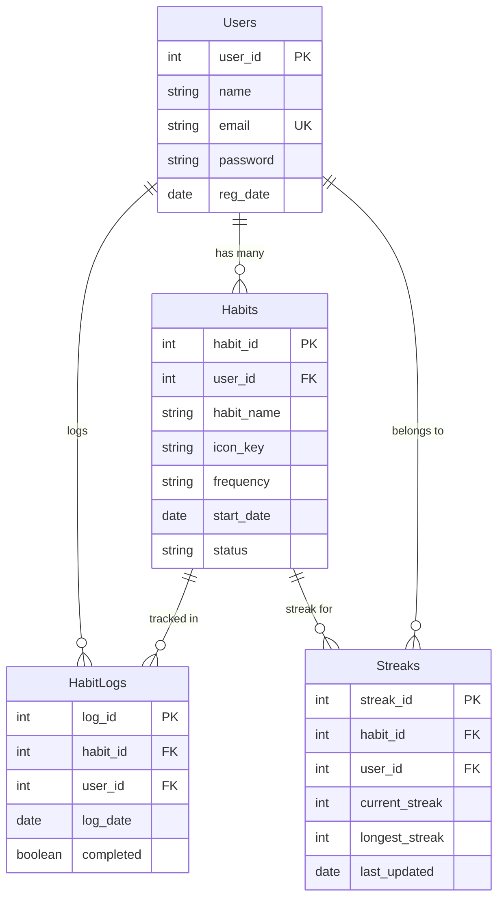

# HabitGarden — Database Documentation

## Database: MySQL
- **Port**: 3306
- **Database Name**: `habitgarden`
- **Driver**: `com.mysql.cj.jdbc.Driver` (JAR: `mysql-connector-j-8.3.0.jar`)
- **Auto-creates**: The database and all tables are auto-created on first run via `DBUtil.initSchema()`

---

## Database Files

| File | Purpose |
|---|---|
| [DBUtil.java](file:///Users/snehithaneelakanti/apache-tomcat-9.0.115/webapps/HabitGarden/WEB-INF/src/com/habitgarden/util/DBUtil.java) | Connection + MySQL schema creation |
| [UserDAO.java](file:///Users/snehithaneelakanti/apache-tomcat-9.0.115/webapps/HabitGarden/WEB-INF/src/com/habitgarden/dao/UserDAO.java) | Register, find by email |
| [HabitDAO.java](file:///Users/snehithaneelakanti/apache-tomcat-9.0.115/webapps/HabitGarden/WEB-INF/src/com/habitgarden/dao/HabitDAO.java) | CRUD habits, streaks, seed defaults |
| [HabitLogDAO.java](file:///Users/snehithaneelakanti/apache-tomcat-9.0.115/webapps/HabitGarden/WEB-INF/src/com/habitgarden/dao/HabitLogDAO.java) | Log completions, query history |

---

## Schema (4 Tables)

### `Users`
```sql
CREATE TABLE Users (
  user_id   INT AUTO_INCREMENT PRIMARY KEY,
  name      VARCHAR(100) NOT NULL,
  email     VARCHAR(150) UNIQUE NOT NULL,
  password  VARCHAR(255) NOT NULL,       -- SHA-256 + Base64
  reg_date  DATE DEFAULT CURRENT_DATE
);
```

### `Habits`
```sql
CREATE TABLE Habits (
  habit_id   INT AUTO_INCREMENT PRIMARY KEY,
  user_id    INT NOT NULL,
  habit_name VARCHAR(100) NOT NULL,
  icon_key   VARCHAR(50)  DEFAULT 'leaf',
  frequency  VARCHAR(10)  DEFAULT 'daily',
  start_date DATE         DEFAULT CURRENT_DATE,
  status     VARCHAR(10)  DEFAULT 'active',
  FOREIGN KEY (user_id) REFERENCES Users(user_id)
);
```

### `HabitLogs`
```sql
CREATE TABLE HabitLogs (
  log_id     INT AUTO_INCREMENT PRIMARY KEY,
  habit_id   INT NOT NULL,
  user_id    INT NOT NULL,
  log_date   DATE NOT NULL,
  completed  BOOLEAN DEFAULT FALSE,
  FOREIGN KEY (habit_id) REFERENCES Habits(habit_id),
  FOREIGN KEY (user_id)  REFERENCES Users(user_id)
);
```

### `Streaks`
```sql
CREATE TABLE Streaks (
  streak_id      INT AUTO_INCREMENT PRIMARY KEY,
  habit_id       INT NOT NULL,
  user_id        INT NOT NULL,
  current_streak INT DEFAULT 0,
  longest_streak INT DEFAULT 0,
  last_updated   DATE,
  FOREIGN KEY (habit_id) REFERENCES Habits(habit_id),
  FOREIGN KEY (user_id)  REFERENCES Users(user_id)
);
```

---

## Sample Datasets

### `Users` — 3 registered users
| user_id | name | email | password (SHA-256) | reg_date |
|---|---|---|---|---|
| 1 | Aarav Sharma | aarav@example.com | `dGVzdDEyMzQ1Ng==` | 2026-01-15 |
| 2 | Priya Nair | priya@example.com | `cHJpeWFAMTIz...` | 2026-02-01 |
| 3 | Snehitha | snehitha@example.com | `T6JRF+zX7nf5...` | 2026-03-10 |

### `Habits` — Aarav's habits (user_id=1)
| habit_id | user_id | habit_name | icon_key | frequency | start_date | status |
|---|---|---|---|---|---|---|
| 1 | 1 | Morning Meditation | meditation | daily | 2026-01-15 | active |
| 2 | 1 | Drink 8 Glasses of Water | water | daily | 2026-01-15 | active |
| 3 | 1 | Read for 20 Minutes | book | daily | 2026-01-15 | active |
| 4 | 1 | Evening Walk / Exercise | exercise | daily | 2026-01-15 | active |
| 5 | 1 | Sleep by 11pm | sleep | daily | 2026-01-20 | active |
| 6 | 1 | Learn Spanish | star | daily | 2026-02-10 | active |
| 7 | 1 | No Junk Food | nutrition | daily | 2026-02-10 | deleted |

### `HabitLogs` — Aarav's daily completions
| log_id | habit_id | user_id | log_date | completed |
|---|---|---|---|---|
| 1 | 1 | 1 | 2026-03-09 | TRUE |
| 2 | 2 | 1 | 2026-03-09 | TRUE |
| 3 | 3 | 1 | 2026-03-09 | FALSE |
| 4 | 4 | 1 | 2026-03-09 | TRUE |
| 5 | 1 | 1 | 2026-03-10 | TRUE |
| 6 | 2 | 1 | 2026-03-10 | TRUE |
| 7 | 3 | 1 | 2026-03-10 | TRUE |
| 8 | 4 | 1 | 2026-03-10 | TRUE |
| 9 | 5 | 1 | 2026-03-10 | FALSE |
| 10 | 1 | 1 | 2026-03-11 | TRUE |
| 11 | 2 | 1 | 2026-03-11 | TRUE |
| 12 | 3 | 1 | 2026-03-11 | TRUE |

### `Streaks` — Aarav's streak tracking
| streak_id | habit_id | user_id | current_streak | longest_streak | last_updated |
|---|---|---|---|---|---|
| 1 | 1 | 1 | 3 | 15 | 2026-03-11 |
| 2 | 2 | 1 | 3 | 10 | 2026-03-11 |
| 3 | 3 | 1 | 2 | 8 | 2026-03-11 |
| 4 | 4 | 1 | 2 | 12 | 2026-03-10 |
| 5 | 5 | 1 | 0 | 5 | 2026-03-10 |

---

## How It All Connects


